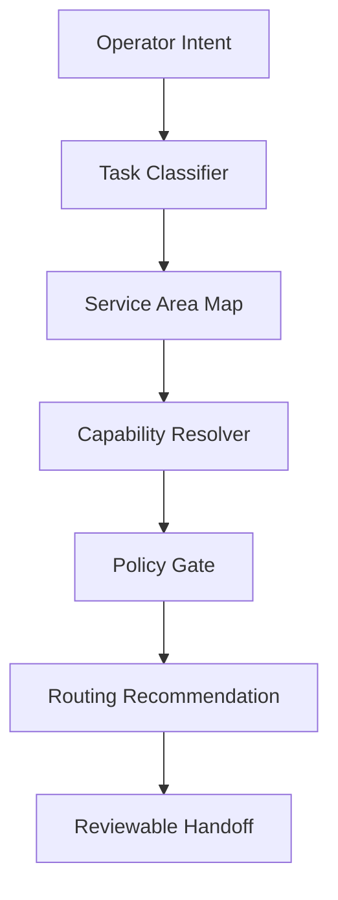

# Modular Adaptive Orchestrator Spec v0.1

Status: Draft for CORE-HUB review  
Generated: 2026-07-04  
Scope: Capability-based orchestration, service-area routing, modular agent connection  
Authority: No implementation, deployment, automation, registry promotion, or agent activation authorized by this document

## 1. Purpose

This spec defines how MIRRORNODE can route work through an adaptive agent stack without hardwiring tasks to fixed names, providers, or services.

The orchestrator should select and connect agents by:

- capability
- service area
- current registry status
- authority boundary
- blocked actions
- review requirements
- available evidence
- expected output contract

The goal is modular adaptation: when a service area changes, a provider changes, or a new agent becomes available, the system can re-route work without collapsing governance boundaries or treating active use as authority.

## 2. Core Principle

The orchestrator does not grant authority.

The orchestrator may:

- classify work
- identify required capabilities
- identify eligible agents or services
- assemble a handoff path
- require review gates
- produce a routing recommendation
- preserve traceability

The orchestrator must not:

- approve execution
- ratify canon
- promote agents
- bypass security review
- treat commercial use as governance legitimacy
- treat provider availability as authority
- treat successful routing as approval

## 3. Architecture



## 4. Required Components

| Component | Purpose | Authority Limit |
| --- | --- | --- |
| Agent Registry | Stores agent status, lane, boundaries, blocked actions, and evidence class. | Does not activate agents by presence alone. |
| Capability Map | Lists what each agent, model, tool, or service can do. | Capability does not equal permission. |
| Service Area Map | Classifies work by domain, such as security, commerce, canon, memory, execution, family/game, research, or deployment. | Service area does not grant execution authority. |
| Policy Gate | Determines required review, blocked actions, and approval path. | Recommends routing; does not approve by itself. |
| Handoff Contract | Defines required input, output, trace, reviewer, and completion fields. | Output remains prepare-and-submit unless approved. |
| Adapter Layer | Connects providers, tools, repos, APIs, and local services. | Adapter availability does not imply authority. |

## 5. Registry Contract

Every orchestratable agent or service needs a machine-readable card.

```yaml
agent_id: merlin
display_name: Merlin
status: manifest_ready_pending_boundary
lane: planning_advisory
evidence_class: partial_evidence
capabilities:
  - sequencing
  - dependency_mapping
  - orchestration_planning
service_areas:
  - governance_review
  - implementation_planning
blocked_actions:
  - authorize_execution
  - ratify_canon
  - promote_agents
  - bypass_security_review
requires_review_for:
  - deployment_plan
  - automation_plan
  - payment_or_secret_adjacent_plan
handoff_outputs:
  - sequence_return
  - dependency_warning
  - deferred_implementation_list
```

## 6. Capability Contract

Capabilities must be specific enough to route work safely.

Good:

```yaml
capabilities:
  - evidence_classification
  - contradiction_flagging
  - source_gap_detection
```

Too broad:

```yaml
capabilities:
  - truth
  - intelligence
  - command
```

Capabilities describe function, not rank.

## 7. Service Area Contract

Service areas define the operating domain of a task.

```yaml
service_areas:
  canon_control:
    default_authority: CORE-HUB
    requires_review:
      - THEIA
      - THOTH
      - Ptah when security or authority risk appears

  commercial_offer:
    default_authority: operator_review
    requires_review:
      - Ptah for authority or payment-risk claims
      - THOTH for source-backed claims

  operational_execution:
    default_authority: prepare_and_submit
    requires_review:
      - Ptah for material execution
      - THEIA for integration
      - operator approval before action

  memory_curation:
    default_authority: recommendation_only
    requires_review:
      - Librarian
      - THOTH when evidence claims are present
      - CORE-HUB for canon placement

  family_game:
    default_authority: operator_review
    requires_review:
      - THEIA for continuity
      - operator approval for public or commercial movement
```

## 8. Routing Request Contract

Every adaptive routing request should carry:

```yaml
routing_request:
  trace_id:
  operator_intent:
  task_summary:
  service_area:
  required_capabilities:
  sensitivity:
    secrets: false
    payments: false
    legal: false
    private_context: false
    production: false
  source_inputs:
  expected_output:
  blocked_actions:
  desired_reviewers:
```

If service area is unknown, the orchestrator must classify first and route as advisory only.

## 9. Routing Decision Contract

The orchestrator should return:

```yaml
routing_decision:
  trace_id:
  service_area:
  selected_path:
    - agent_id:
      reason:
      allowed_actions:
      required_output:
  required_reviews:
  blocked_actions_triggered:
  approval_needed_before:
  deferred_actions:
  confidence:
  review_boundary:
```

The routing decision is not approval. It is a proposed path.

## 10. Example: Osiris Fulfillment Automation

Input:

```yaml
task_summary: Prepare Osiris Audit fulfillment automation.
service_area: operational_execution
required_capabilities:
  - workflow_design
  - payment_boundary_awareness
  - security_review
  - trace_design
sensitivity:
  payments: true
  production: true
  secrets: possible
```

Recommended path:

| Step | Seat | Purpose | Output |
| --- | --- | --- | --- |
| 1 | Merlin | Sequence the automation plan. | Dependency order and deferred implementation list. |
| 2 | Ptah | Review payment, secret, deployment, and automation risk. | Advisory security return. |
| 3 | THOTH | Verify claims and source requirements. | Evidence boundary return. |
| 4 | THEIA | Integrate returns into execution checkpoint. | Reviewable integration packet. |
| 5 | Osiris Execution Surface | Execute only after approval. | Traceable prepared output or approved action. |

Blocked until:

- material execution definition is accepted
- trace checkpoint exists
- payment and secret handling rules are explicit
- operator approval is recorded

## 11. Example: Arvid Prototype Work

Input:

```yaml
task_summary: Verify and polish Arvid playable prototype.
service_area: family_game
required_capabilities:
  - frontend_review
  - playability_check
  - continuity_tracking
sensitivity:
  production: false
  payments: false
  secrets: false
  private_context: limited
```

Recommended path:

| Step | Seat or Service | Purpose |
| --- | --- | --- |
| 1 | THEIA | Preserve continuity and define playability goal. |
| 2 | Builder tool or local runtime | Run build and local verification. |
| 3 | Operator | Playtest and approve feel. |
| 4 | Librarian | Recommend placement of prototype notes. |

No Ptah review is required unless deployment, public sharing, child privacy, payment, or account access enters scope.

## 12. Adapter Layer

Adapters allow the orchestrator to connect to changing providers and services.

Adapter examples:

```yaml
adapters:
  openai:
    type: model_provider
    service_areas:
      - drafting
      - coding
      - review

  github:
    type: repo_provider
    service_areas:
      - code_review
      - pr_management
      - workflow_inspection

  vercel:
    type: deployment_provider
    service_areas:
      - deployment
      - logs
      - environment_review

  stripe:
    type: payment_provider
    service_areas:
      - checkout
      - payment_review
```

Adapter rules:

- Adapter availability is not permission.
- Provider capability is not agent authority.
- Tool connection must be scoped to a service area and policy gate.
- Material actions require explicit approval.

## 13. Eligibility Rules

An agent or service is eligible for routing only if:

1. Its status permits advisory or operational use in the requested lane.
2. It has the required capability.
3. It is not blocked by the task sensitivity.
4. Its output contract matches the task need.
5. Required review gates are known.
6. Its use does not imply canon, security, registry, or commercial authority beyond its boundary.

If no eligible agent exists, return:

```yaml
verdict: no_eligible_route
reason:
  - missing_capability
  - unresolved_authority_boundary
  - blocked_action_triggered
  - missing_review_gate
```

## 14. Minimum Viable Implementation Later

When implementation is authorized, the smallest safe version is:

```text
/docs/agent-stack/
  registry/
    agents.yaml
    capabilities.yaml
    service-areas.yaml
    policy-gates.yaml
  routing/
    routing-request.schema.json
    routing-decision.schema.json
    examples/
      osiris-fulfillment.yaml
      arvid-prototype.yaml
```

This can begin as documentation and schema only before any runtime automation exists.

## 15. Ratification Questions

1. Does CORE-HUB accept capability-based routing as a governance-safe abstraction?
2. What statuses are eligible for advisory routing?
3. What statuses are eligible for operational routing?
4. Can a service provider be routed like an agent, or must providers remain adapters only?
5. Who owns the service area map?
6. Who owns the capability map?
7. Who approves changes to policy gates?
8. What sensitivity flags must block automatic routing?
9. What output contracts are mandatory before execution?
10. Where should routing decisions be logged?

## 16. Holding Statement

The modular adaptive orchestrator should automate route discovery, eligibility checks, policy gates, and handoff structure.

It must not automate authority.

MIRRORNODE scales by making the path adaptive while keeping approval, canon, and material execution governed.
